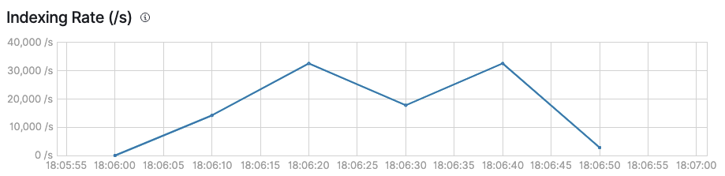
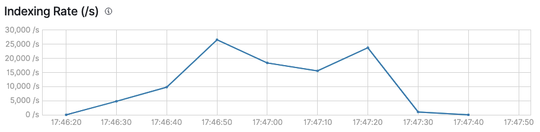

# Go Dcp Elasticsearch

[](https://pkg.go.dev/github.com/Trendyol/go-dcp-elasticsearch) [](https://goreportcard.com/report/github.com/Trendyol/go-dcp-elasticsearch)

Go implementation of
the [Elasticsearch Connect Couchbase](https://github.com/couchbase/couchbase-elasticsearch-connector).

**Go Dcp Elasticsearch** streams documents from Couchbase Database Change Protocol (DCP) and writes to
Elasticsearch index in near real-time.

## Features

* **Less resource usage** and **higher throughput**(see [Benchmarks](#benchmarks)).
* **Custom routing** support(see [Example](#example)).
* **Update multiple documents** for a DCP event(see [Example](#example)).
* Handling different DCP events such as **expiration, deletion and mutation**(see [Example](#example)).
* **Elasticsearch compression request body** support.
* **Managing batch configurations** such as maximum batch size, batch bytes, batch ticker durations.
* **Scale up and down** by custom membership algorithms(Couchbase, KubernetesHa, Kubernetes StatefulSet or
  Static, see [examples](https://github.com/Trendyol/go-dcp#examples)).
* **Easily manageable configurations**.

## Benchmarks

The benchmark was made with the  **1,001,006** Couchbase document, because it is possible to more clearly observe the
difference in the batch structure between the two packages. **Default configurations** for Java Elasticsearch Connect Couchbase
used for both connectors.

| Package                                         | Time to Process Events | Elasticsearch Indexing Rate(/s) | Average CPU Usage(Core) | Average Memory Usage |
|:------------------------------------------------|:----------------------:|:-------------------------------:|:-----------------------:|:--------------------:|
| **Go Dcp Elasticsearch**(Go 1.20) |        **50s**         |        |        **0.486**        |      **408MB**       
| Java Elasticsearch Connect Couchbase(JDK15)     |          80s           |      |          0.31           |        1091MB         

## Example
[Struct Config](example/struct-config/main.go)
```go
func mapper(event couchbase.Event) []document.ESActionDocument {
	if event.IsMutated {
		e := document.NewIndexAction(event.Key, event.Value, nil)
		return []document.ESActionDocument{e}
	}
	e := document.NewDeleteAction(event.Key, nil)
	return []document.ESActionDocument{e}
}

func main() {
	connector, err := dcpelasticsearch.NewConnectorBuilder(config.Config{
		Elasticsearch: config.Elasticsearch{
			CollectionIndexMapping: map[string]string{
				"_default": "indexname",
			},
			Urls: []string{"http://localhost:9200"},
		},
		Dcp: dcpConfig.Dcp{
			Username:   "user",
			Password:   "password",
			BucketName: "dcp-test",
			Hosts:      []string{"localhost:8091"},
			Dcp: dcpConfig.ExternalDcp{
				Group: dcpConfig.DCPGroup{
					Name: "groupName",
					Membership: dcpConfig.DCPGroupMembership{
						Type: "static",
					},
				},
			},
			Metadata: dcpConfig.Metadata{
				Config: map[string]string{
					"bucket":     "checkpoint-bucket-name",
					"scope":      "_default",
					"collection": "_default",
				},
				Type: "couchbase",
			},
		},
	}).
		SetMapper(mapper).
		Build()
	if err != nil {
		panic(err)
	}

	defer connector.Close()
	connector.Start()
}
```

[File Config](example/simple/main.go)
## Configuration

### Dcp Configuration

Check out on [go-dcp](https://github.com/Trendyol/go-dcp#configuration)

### Elasticsearch Specific Configuration

| Variable                               | Type              | Required | Default  | Description                                                                                         |                                                           
|----------------------------------------|-------------------|----------|----------|-----------------------------------------------------------------------------------------------------|
| `elasticsearch.collectionIndexMapping` | map[string]string | yes      |          | Defines which Couchbase collection events will be written to which index                            |
| `elasticsearch.urls`                   | []string          | yes      |          | Elasticsearch connection urls                                                                       |
| `elasticsearch.typeName`               | string            | no       | _doc     | Defines Elasticsearch index type name                                                               |
| `elasticsearch.batchSizeLimit`         | int               | no       | 1000     | Maximum message count for batch, if exceed flush will be triggered.                                 |
| `elasticsearch.batchTickerDuration`    | time.Duration     | no       | 10s      | Batch is being flushed automatically at specific time intervals for long waiting messages in batch. |
| `elasticsearch.batchByteSizeLimit`     | int               | no       | 10485760 | Maximum size(byte) for batch, if exceed flush will be triggered.                                    |
| `elasticsearch.maxConnsPerHost`        | int               | no       | 512      | Maximum number of connections per each host which may be established                                |
| `elasticsearch.maxIdleConnDuration`    | time.Duration     | no       | 10s      | Idle keep-alive connections are closed after this duration.                                         | 
| `elasticsearch.compressionEnabled`     | boolean           | no       | false    | Compression can be used if message size is large, CPU usage may be affected.                        |

## Exposed metrics

| Metric Name                                             | Description                   | Labels | Value Type |
|---------------------------------------------------------|-------------------------------|--------|------------|
| elasticsearch_connector_latency_ms                      | Time to adding to the batch.  | N/A    | Gauge      |
| elasticsearch_connector_bulk_request_process_latency_ms | Time to process bulk request. | N/A    | Gauge      |

For DCP related metrics see [also](https://github.com/Trendyol/go-dcp#exposed-metrics).

## Contributing

Go Dcp Elasticsearch is always open for direct contributions. For more information please check
our [Contribution Guideline document](./CONTRIBUTING.md).

## License

Released under the [MIT License](LICENSE).