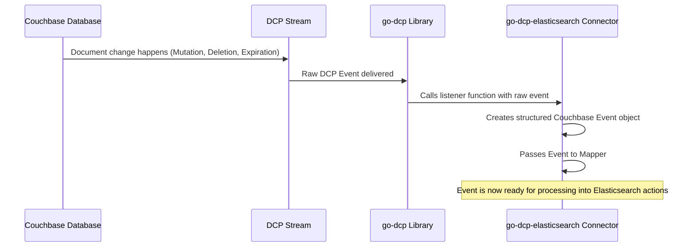

# Chapter 1: Couchbase Event

Welcome to the `go-dcp-elasticsearch` tutorial! In this chapter, we'll start at the very beginning: the raw data that drives everything this connector does. This data comes directly from Couchbase and is called a "Couchbase Event".

Imagine you have a Couchbase database where you store information, like user profiles or product details. Every time you create a new document, change an existing one, or delete something, Couchbase records that change. The `go-dcp-elasticsearch` connector's main job is to listen for these changes and send them to Elasticsearch so you can search and analyze them easily.

The fundamental piece of information representing one of these changes is what we call a **Couchbase Event**. It's like a single notification saying, "Hey, something just happened to this specific document!".

## What is a Couchbase Event?

Think of a Couchbase Event as a snapshot of a single change operation on a document within your Couchbase database. It's the raw material that tells the connector exactly what happened.

This event contains all the necessary information about that particular change, such as:

*   Which document was affected (its unique **Key**).
*   What the document content looks like **after** the change (the **Value**, for additions or modifications).
*   Whether the document was added, changed, or deleted (**IsMutated**, **IsDeleted**, **IsExpired** flags).
*   Important details about where the document lives in Couchbase (like the **CollectionName**).
*   Version and ordering information (like **Cas**, **SeqNo**, **RevNo**, **VbID**).
*   When the change happened (**EventTime**).

The `go-dcp-elasticsearch` connector receives a stream of these events from Couchbase. Each event is an independent piece of information about a document change.

## How the Connector Gets Events

The `go-dcp-elasticsearch` connector uses Couchbase's Database Change Protocol (DCP) to receive a continuous stream of these events directly from the database.

When the connector is running, it constantly listens for these incoming events. The core part of the connector that handles this is a function called the `listener`. This function is called by the underlying `go-dcp` library whenever a change is detected in Couchbase.

Let's look at a simplified version of how the listener function processes these events:

```go
// Simplified snippet from connector.go
func (c *connector) listener(ctx *models.ListenerContext) {
	var e couchbase.Event // Our Couchbase Event type

	// Check the type of the incoming event from the go-dcp library
	switch event := ctx.Event.(type) {
	case models.DcpMutation: // Document was added or changed
		e = couchbase.NewMutateEvent( /* ... details from event ... */ )
	case models.DcpExpiration: // Document expired
		e = couchbase.NewExpireEvent( /* ... details from event ... */ )
	case models.DcpDeletion: // Document was deleted
		e = couchbase.NewDeleteEvent( /* ... details from event ... */ )
	default:
		return // Ignore other event types
	}

	// Now 'e' is our structured Couchbase Event
	// The connector then processes this 'e'
	// ... (more code for processing) ...
}
```

In this code:

1.  The `listener` function receives a `ctx` which contains the raw event from the `go-dcp` library (`ctx.Event`).
2.  It checks the *type* of event received (Mutation, Expiration, or Deletion).
3.  Based on the type, it creates a structured `couchbase.Event` object, populating its fields with information from the raw DCP event.
4.  This `couchbase.Event` object (`e` in the code) is then ready to be processed further by the connector.

This `couchbase.Event` is the standardized way the connector represents *any* change coming from Couchbase, regardless of whether it was a mutation, deletion, or expiration.

## Inside the `couchbase.Event` Structure

The `couchbase.Event` is a Go struct defined in the `couchbase/event.go` file. It groups all the relevant information about a single Couchbase document change.

Here's a simplified view of its structure:

```go
// Simplified snippet from couchbase/event.go
type Event struct {
	Key            []byte    // The document's ID
	Value          []byte    // The document content (for mutations/expirations)
	CollectionName string    // The collection the document belongs to
	EventTime      time.Time // When the event occurred

	IsDeleted bool // True if it was a deletion
	IsExpired bool // True if it was an expiration
	IsMutated bool // True if it was a mutation (add/change)

	// Other metadata like Cas, VbID, SeqNo, RevNo...
	// These are useful for tracking and ordering changes
	Cas    uint64
	VbID   uint16
	SeqNo  uint64
	RevNo  uint64

	// Internal field used by the connector
	ElasticsearchClient *elasticsearch.Client
}
```

When the `listener` function (shown above) receives a raw DCP event, it uses helper functions like `NewMutateEvent`, `NewDeleteEvent`, or `NewExpireEvent` to easily create one of these structured `Event` objects.

For example, the `NewMutateEvent` function takes the details from a raw mutation event and populates the `couchbase.Event` struct:

```go
// Snippet from couchbase/event.go
func NewMutateEvent(
	esClient *elasticsearch.Client,
	key []byte, value []byte,
	collectionName string, cas uint64, eventTime time.Time, vbID uint16, seqNo uint64, revNo uint64,
) Event {
	return Event{
		ElasticsearchClient: esClient,
		Key:                 key,
		Value:               value,
		IsMutated:           true, // Mark as a mutation!
		CollectionName:      collectionName,
		Cas:                 cas,
		EventTime:           eventTime,
		VbID:                vbID,
		SeqNo:               seqNo,
		RevNo:               revNo,
	}
}
```

Notice how `NewMutateEvent` sets `IsMutated: true`, while `NewDeleteEvent` would set `IsDeleted: true`, and `NewExpireEvent` would set `IsExpired: true`. This makes it easy for the rest of the connector to know exactly what kind of change happened.

## Where Events Go Next

Once the `listener` has created a `couchbase.Event`, this event object is passed along to the next stage of the connector's pipeline. As you saw in the snippet from `connector.go`, the event `e` is then passed to the `mapper` function: `actions := c.mapper(e)`.

The `mapper` function's job is to take this `couchbase.Event` and decide what action(s) should be performed in Elasticsearch as a result. We will dive into the `mapper` and the concept of Elasticsearch Actions in the next chapter.

## High-Level Flow

Here's a simple diagram showing how a Couchbase Event travels to the connector's listener:



This diagram illustrates that the `couchbase.Event` is the standard format that the `go-dcp-elasticsearch` connector works with after receiving the raw change information from the Couchbase DCP stream via the `go-dcp` library.

## Summary

In this first chapter, we learned that a **Couchbase Event** is the core building block for the `go-dcp-elasticsearch` connector. It represents a single change (add, modify, or delete) to a document in Couchbase, carrying all the essential information about that change, like the document key, content (if applicable), and metadata.

The connector receives these events via the Couchbase DCP protocol and converts them into a structured `couchbase.Event` object, which is then used as input for the next steps in the data replication process.

Now that we understand the source of the data, let's look at what the connector *does* with this data to prepare it for Elasticsearch.

[Next Chapter: Elasticsearch Action Document](02_elasticsearch_action_document_.md)