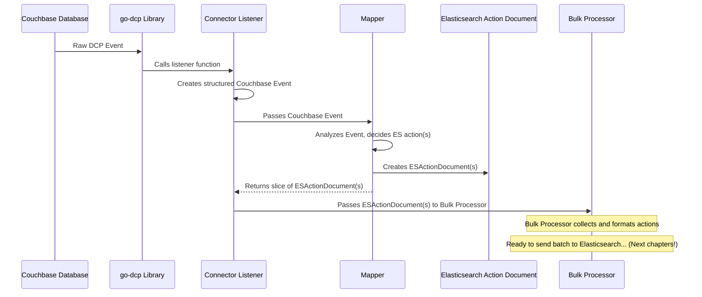

# Chapter 2: Elasticsearch Action Document

Welcome back to the `go-dcp-elasticsearch` tutorial! In the previous chapter, [Chapter 1: Couchbase Event](01_couchbase_event_.md), we learned that the raw data coming from Couchbase about changes is called a **Couchbase Event**. It tells us *what happened* (mutation, deletion, expiration) and *to which document*.

But Elasticsearch doesn't understand "Couchbase Events" directly. Elasticsearch needs specific instructions telling it exactly what to do with a document in a particular index. This is where the **Elasticsearch Action Document** comes in.

## What is an Elasticsearch Action Document?

Imagine you have the Couchbase Event (like "document 'user::123' was updated with this new content"). Your goal is to update the corresponding document in Elasticsearch so your search results are up-to-date.

An **Elasticsearch Action Document** is the specific, ready-to-send instruction that the connector prepares for Elasticsearch to perform a single operation on a single document. It translates the high-level "document changed" information from Couchbase into a precise command like "Index this document with ID 'user::123' into the 'users' index" or "Delete the document with ID 'old::doc' from the 'archive' index".

It's the structured data format that bridges the gap between a Couchbase change and an Elasticsearch operation.

Think of the [Couchbase Event](01_couchbase_event_.md) as the raw ingredient, and the **Elasticsearch Action Document** as the prepared dish, formatted exactly how the Elasticsearch "restaurant" likes it.

## Key Ingredients of an Elasticsearch Action Document

What information does Elasticsearch need for a single document operation?

Looking at the code (specifically the `ESActionDocument` struct in `elasticsearch/document/document.go`), we see the essential pieces:

```go
// Simplified snippet from elasticsearch/document/document.go
type ESActionDocument struct {
	ID        []byte   // The unique ID of the document in Elasticsearch
	Type      EsAction // What action to perform (Index, Delete, etc.)
	IndexName string   // The name of the Elasticsearch index
	Source    []byte   // The document content (for Index/Update actions)
	Routing   *string  // Optional routing value
}
```

Let's break down these fields:

*   **`ID`**: This is the unique identifier for the document in Elasticsearch. It often corresponds directly to the document's Key from the [Couchbase Event](01_couchbase_event_.md).
*   **`Type`**: This specifies the *kind* of operation Elasticsearch should perform. Is it adding/updating the document? Deleting it? Performing a partial update?
*   **`IndexName`**: Elasticsearch stores documents in "indexes" (similar to tables in a relational database, but more flexible). This field tells Elasticsearch which index the operation should apply to.
*   **`Source`**: For actions that involve sending data (like adding or updating), this field holds the actual JSON content of the document or the partial update/script details.
*   **`Routing`**: An optional field that helps control which shard a document resides on in Elasticsearch, important for performance in large clusters.

## Types of Elasticsearch Actions (`EsAction`)

The `Type` field uses an `EsAction` type, which is just a way to clearly define the possible operations. The code defines a few common ones:

```go
// Snippet from elasticsearch/document/document.go
type EsAction string

const (
	Index        EsAction = "Index"
	Delete       EsAction = "Delete"
	DocUpdate    EsAction = "DocUpdate"
	ScriptUpdate EsAction = "ScriptUpdate"
)
```

Here's a quick look at what each means:

| Action Name  | Description                                                                 | `Source` Field Used? | Typical Use Case                                  |
| :----------- | :-------------------------------------------------------------------------- | :------------------- | :------------------------------------------------ |
| `Index`      | Add a new document or replace an existing one entirely.                     | Yes                  | Couchbase document mutation/expiration (full sync) |
| `Delete`     | Remove a document from the index.                                           | No                   | Couchbase document deletion                       |
| `DocUpdate`  | Partially update an existing document using a `doc` field. Creates if not exists (`doc_as_upsert`). | Yes                  | Couchbase document mutation (partial sync)        |
| `ScriptUpdate` | Partially update an existing document using an Elasticsearch script. Creates if not exists (`scripted_upsert`). | Yes                  | Couchbase document mutation (complex updates)     |

For a simple connector that just mirrors Couchbase documents, `Index` (for mutations/expirations) and `Delete` (for deletions) are the most common actions.

## Creating Elasticsearch Action Documents with the Mapper

As we saw at the end of [Chapter 1: Couchbase Event](01_couchbase_event_.md), the `couchbase.Event` is passed to the `mapper` function. The `mapper`'s primary responsibility is to examine the [Couchbase Event](01_couchbase_event_.md) and produce one or more `ESActionDocument` objects.

The `go-dcp-elasticsearch` library provides helper functions to make creating these `ESActionDocument`s easy, found in `elasticsearch/document/document.go`.

Let's look at a simplified version of the `DefaultMapper` provided by the library (seen in `mapper.go` and examples like `example/simple/main.go`):

```go
// Simplified snippet from mapper.go
func DefaultMapper(event couchbase.Event) []document.ESActionDocument {
	// Check the type of the Couchbase Event
	if event.IsMutated {
		// If it's a mutation (add/change)
		// We want to Index (add/replace) the document in Elasticsearch

		// Create an Index action
		// NewIndexAction takes the Couchbase Key (as ID),
		// the Couchbase Value (as Source), and optional routing.
		action := document.NewIndexAction(event.Key, event.Value, nil)

		// Return a slice containing this single action
		return []document.ESActionDocument{action}

	} else {
		// If it's a deletion or expiration
		// We want to Delete the document from Elasticsearch

		// Create a Delete action
		// NewDeleteAction takes the Couchbase Key (as ID) and optional routing.
		action := document.NewDeleteAction(event.Key, nil)

		// Return a slice containing this single action
		return []document.ESActionDocument{action}
	}
}
```

This is the core logic of how a `Couchbase Event` is transformed into an `ESActionDocument`:

1.  The `mapper` function receives a single `event` (a `couchbase.Event`).
2.  It checks if `event.IsMutated` is true.
3.  If true, it knows the document content is in `event.Value` and the ID is in `event.Key`. It calls `document.NewIndexAction` to create an `ESActionDocument` with `Type: Index`, `ID: event.Key`, and `Source: event.Value`.
4.  If `event.IsMutated` is false (meaning it's a deletion or expiration), it knows the document should be removed from Elasticsearch. It calls `document.NewDeleteAction` to create an `ESActionDocument` with `Type: Delete` and `ID: event.Key`.
5.  The `mapper` always returns a slice (`[]`) of `ESActionDocument`, even if it's just one action. This allows for more complex mappers that might generate multiple actions from a single Couchbase Event (e.g., indexing parts of a document into different indexes).

### Example Mapping

Let's visualize the transformation for a simple case:

**Input (Couchbase Event - Mutation):**

```
Key: []byte("user::42")
Value: []byte(`{"name": "Alice", "city": "London"}`)
IsMutated: true
IsDeleted: false
IsExpired: false
CollectionName: "_default"
... other metadata ...
```

**Mapping Process (inside `DefaultMapper`):**

```go
if event.IsMutated { // True
    // Create Index action
    action := document.NewIndexAction(event.Key, event.Value, nil)
    // action is now {ID: []byte("user::42"), Type: Index, IndexName: "", Source: []byte(`{"name": "Alice", "city": "London"}`), Routing: nil}
    return []document.ESActionDocument{action}
} else { // False
    // Skip delete logic
}
```

**Output (Slice of ESActionDocument):**

```
[
  {
    ID: []byte("user::42"),
    Type: Index,
    IndexName: "", // IndexName is often set later by the Bulk Processor using the config
    Source: []byte(`{"name": "Alice", "city": "London"}`),
    Routing: nil
  }
]
```

Notice that the `IndexName` is empty in the `NewIndexAction` call. The `go-dcp-elasticsearch` connector automatically determines the correct target Elasticsearch index based on the Couchbase Collection Name and the `CollectionIndexMapping` defined in the [Config](04_config_.md). This happens *after* the Mapper creates the action, within the [Bulk Processor](06_bulk_processor_.md). You can override this by using `NewIndexActionWithIndexName` if needed.

Now consider a deletion:

**Input (Couchbase Event - Deletion):**

```
Key: []byte("user::42")
Value: nil
IsMutated: false
IsDeleted: true
IsExpired: false
CollectionName: "_default"
... other metadata ...
```

**Mapping Process (inside `DefaultMapper`):**

```go
if event.IsMutated { // False
    // Skip index logic
} else { // True
    // Create Delete action
    action := document.NewDeleteAction(event.Key, nil)
    // action is now {ID: []byte("user::42"), Type: Delete, IndexName: "", Source: nil, Routing: nil}
    return []document.ESActionDocument{action}
}
```

**Output (Slice of ESActionDocument):**

```
[
  {
    ID: []byte("user::42"),
    Type: Delete,
    IndexName: "", // IndexName is often set later by the Bulk Processor using the config
    Source: nil,   // No source needed for delete
    Routing: nil
  }
]
```

These `ESActionDocument` objects are the fundamental units that the connector sends towards Elasticsearch.

## Where Elasticsearch Action Documents Go Next

Once the `mapper` function returns the slice of `ESActionDocument`s, they are not sent to Elasticsearch immediately one by one. Sending individual requests for every document change would be very inefficient.

Instead, these actions are passed to a component called the **Bulk Processor**. The [Bulk Processor](06_bulk_processor_.md) collects multiple `ESActionDocument`s, groups them together into larger batches, formats them into a special newline-delimited JSON structure required by Elasticsearch's Bulk API, and then sends the entire batch as a single request.

Here's an updated high-level flow showing where the `ESActionDocument` fits in:



As shown, the `ESActionDocument` is the output of the `Mapper` and the input for the [Bulk Processor](06_bulk_processor_.md).

## Inside the `ESActionDocument` Implementation

Let's quickly peek at how the `ESActionDocument` is defined in `elasticsearch/document/document.go`:

```go
// File: elasticsearch/document/document.go
package document

import "fmt"

// EsAction defines the type of operation for Elasticsearch
type EsAction string

// Constants for possible Elasticsearch actions
const (
	Index        EsAction = "Index"
	Delete       EsAction = "Delete"
	DocUpdate    EsAction = "DocUpdate"
	ScriptUpdate EsAction = "ScriptUpdate"
)

// ESActionDocument represents a single operation instruction for Elasticsearch
type ESActionDocument struct {
	Routing   *string // Optional field for routing
	Type      EsAction // The action type (Index, Delete, etc.)
	IndexName string // The target index name
	Source    []byte // The document content or script (for Index/Update)
	ID        []byte // The document ID
}

// Helper function to create a Delete action
func NewDeleteAction(key []byte, routing *string) ESActionDocument {
	return ESActionDocument{
		ID:      key,
		Routing: routing,
		Type:    Delete,
	}
}

// Helper function to create an Index action
func NewIndexAction(key []byte, source []byte, routing *string) ESActionDocument {
	return ESActionDocument{
		ID:      key,
		Routing: routing,
		Source:  source,
		Type:    Index,
	}
}

// ... other New...Action functions for DocUpdate, ScriptUpdate, and versions with indexName ...
```

This code snippet confirms our understanding: `ESActionDocument` is a struct holding the necessary details for an Elasticsearch operation, and helper functions like `NewDeleteAction` and `NewIndexAction` make it straightforward to create these struct instances. The `EsAction` type is simply a string alias used for clarity.

The `Source` field for `DocUpdate` actions is constructed by the helper functions to wrap the actual content in `{"partialIndexObjectName": ...}` format, as seen in `NewDocUpdateAction`. This is to match the expected Elasticsearch format for partial updates.

Later, the [Bulk Processor](06_bulk_processor_.md) will take these `ESActionDocument` structs and format them into the specific JSON structure needed for the Elasticsearch Bulk API. The `getEsActionJSON` function in `elasticsearch/bulk/bulk.go` is responsible for this final formatting step.

## Summary

In this chapter, we explored the **Elasticsearch Action Document**. We learned that it's the specific instruction format (containing action type, ID, index, and source data) that the `go-dcp-elasticsearch` connector creates to tell Elasticsearch what to do with a single document change.

We saw how the `mapper` function acts as the translator, taking the raw [Couchbase Event](01_couchbase_event_.md) and producing one or more `ESActionDocument`s using helper functions like `NewIndexAction` and `NewDeleteAction`. These action documents are then passed along to the next stage of the connector's processing pipeline.

Now that we understand the input ([Couchbase Event](01_couchbase_event_.md)) and the intermediate instruction format (`ESActionDocument`), let's zoom out and look at the overall orchestrator of this process: the **Connector** itself.

[Next Chapter: Connector](03_connector_.md)