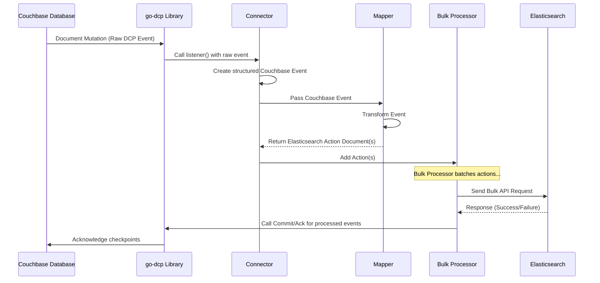

# Chapter 3: Connector

Welcome back! In the previous chapters, we explored the fundamental building blocks: the [Couchbase Event](01_couchbase_event_.md), which represents a single change coming from Couchbase, and the [Elasticsearch Action Document](02_elasticsearch_action_document_.md), which is the specific instruction the connector prepares for Elasticsearch.

Now, let's look at the **Connector** itself. If the [Couchbase Event](01_couchbase_event_.md) is the ingredient and the [Elasticsearch Action Document](02_elasticsearch_action_document_.md) is the prepared dish, the **Connector** is the entire kitchen and dining staff combined. It's the main component that brings everything together to actually perform the task of replicating data from Couchbase to Elasticsearch.

## What is the Connector?

Think of the **Connector** as the central control tower for the entire data replication process. Its primary responsibility is to:

1.  **Connect:** Establish connections to both your Couchbase cluster (using Couchbase's Database Change Protocol, DCP) and your Elasticsearch cluster.
2.  **Listen:** Continuously listen for changes happening in Couchbase by receiving [Couchbase Event](01_couchbase_event_.md)s.
3.  **Orchestrate:** Manage the flow of these events. It takes each incoming [Couchbase Event](01_couchbase_event_.md) and directs it through the necessary steps:
    *   Translate the [Couchbase Event](01_couchbase_event_.md) into one or more [Elasticsearch Action Document](02_elasticsearch_action_document_.md)s using the [Mapper](05_mapper_.md).
    *   Hand these action documents over to the [Bulk Processor](06_bulk_processor_.md) for efficient sending to Elasticsearch.
4.  **Start & Stop:** Provide methods to start the listening and processing and to gracefully shut down the entire operation.
5.  **Manage Configuration:** Load and apply the settings defined in the [Config](04_config_.md) to control its behavior and how it connects to Couchbase and Elasticsearch.

In essence, the Connector is the glue that holds all the other pieces ([Mapper](05_mapper_.md), [Bulk Processor](06_bulk_processor_.md), [Elasticsearch Client](07_elasticsearch_client_.md), [Sink Response Handler](08_sink_response_handler_.md), and the underlying `go-dcp` library) together and manages their lifecycle.

## How to Use the Connector

The simplest way to start the data replication is by building and starting the Connector. The `go-dcp-elasticsearch` library provides a builder pattern for creating a Connector instance.

You typically:

1.  Create a `NewConnectorBuilder`.
2.  Provide your application's [Config](04_config_.md) (either as a file path or a Go struct).
3.  Optionally customize components like the [Mapper](05_mapper_.md) or [Sink Response Handler](08_sink_response_handler_.md).
4.  Call `Build()` to get the Connector instance.
5.  Call `Start()` to begin processing data.
6.  Call `Close()` when you want to stop.

Let's look at the most basic example (`example/simple/main.go`):

```go
// Simplified snippet from example/simple/main.go
package main

import (
	"github.com/Trendyol/go-dcp-elasticsearch"
)

// (Mapper function defined here, see Chapter 5)

func main() {
	// 1. Create a builder with config (config.yml)
	// 2. Optionally set a custom mapper (using the default here)
	// 3. Build the connector instance
	connector, err := dcpelasticsearch.NewConnectorBuilder("config.yml").Build()
	if err != nil {
		panic(err) // Handle errors!
	}

	// Ensure the connector is closed when the program exits
	defer connector.Close()

	// 4. Start the data replication!
	connector.Start()

	// The program will now run, listening for Couchbase changes
	// You'll typically keep the main function running
	// (e.g., use a select{} to wait for a signal)
}
```

This simple code snippet shows how easy it is to get the Connector up and running. You create it using the builder, pass it your [Config](04_config_.md), and call `Start()`. The Connector then takes over, handles all the connections, listening, processing, and sending data based on your configuration and the configured [Mapper](05_mapper_.md).

The `defer connector.Close()` line is important; it ensures that when your program stops (e.g., you press Ctrl+C), the Connector performs a graceful shutdown, stopping the DCP stream and bulk processing.

## Inside the Connector

The `connector` type (`connector.go`) is a Go struct that holds references to the other key components it manages or interacts with:

```go
// Simplified snippet from connector.go
type connector struct {
	dcp                 dcp.Dcp // The go-dcp client to connect to Couchbase
	mapper              Mapper // The Mapper function provided by the user
	config              *config.Config // The loaded configuration
	bulk                *bulk.Bulk // The Bulk Processor instance
	esClient            *elasticsearch.Client // The Elasticsearch client instance
	sinkResponseHandler dcpElasticsearch.SinkResponseHandler // Handles results from Elasticsearch
}
```

When you call `NewConnectorBuilder` and `Build()`, the `newConnector` function does the heavy lifting:

1.  Loads and validates the [Config](04_config_.md).
2.  Creates the underlying `go-dcp` client (`dcp`). It tells the `go-dcp` client to use the `connector.listener` function whenever a [Couchbase Event](01_couchbase_event_.md) arrives.
3.  Creates the [Elasticsearch Client](07_elasticsearch_client_.md) (`esClient`) based on the [Config](04_config_.md).
4.  Creates the [Bulk Processor](06_bulk_processor_.md) (`bulk`), passing it the `esClient`, the mechanism to commit checkpoints back to Couchbase (`dcp.Commit`), and the [Sink Response Handler](08_sink_response_handler_.md).
5.  Assigns these newly created or provided components to the `connector` struct fields.

## The Listener: The Heartbeat

The core of the Connector's processing loop is the `listener` function. As mentioned in [Chapter 1: Couchbase Event](01_couchbase_event_.md), the `go-dcp` library calls this function every time it receives a document change from Couchbase.

Let's revisit and simplify the `listener` function (`connector.go`):

```go
// Simplified snippet from connector.go
func (c *connector) listener(ctx *models.ListenerContext) {
	var couchbaseEvent couchbase.Event // Our structured Couchbase Event

	// Convert the raw DCP event into our structured couchbaseEvent
	switch event := ctx.Event.(type) {
	case models.DcpMutation:
		couchbaseEvent = couchbase.NewMutateEvent(/* ... details ... */)
	case models.DcpExpiration:
		couchbaseEvent = couchbase.NewExpireEvent(/* ... details ... */)
	case models.DcpDeletion:
		couchbaseEvent = couchbase.NewDeleteEvent(/* ... details ... */)
	default:
		return // Ignore unsupported events
	}

	// --- Orchestration Step 1: Map the Couchbase Event to ES Actions ---
	// Use the configured mapper to get ES actions
	esActions := c.mapper(couchbaseEvent)

	// If the mapper returned no actions, we are done with this event
	if len(esActions) == 0 {
		ctx.Ack() // Tell Couchbase we processed this event
		return
	}

	// --- Orchestration Step 2: Send ES Actions to the Bulk Processor ---
	// Add the generated actions to the Bulk Processor's queue
	// The Bulk Processor will batch them up and send to Elasticsearch
	c.bulk.AddActions(ctx, couchbaseEvent.EventTime, esActions, couchbaseEvent.CollectionName, true)

	// Note: ctx.Ack() is NOT called here immediately!
	// The Bulk Processor calls ctx.Ack() AFTER the batch
	// containing these actions is successfully sent to Elasticsearch.
}
```

This function clearly shows the Connector's orchestration role:

1.  Receive the raw event (`ctx.Event`).
2.  Transform it into a standardized `couchbase.Event` (as discussed in [Chapter 1](01_couchbase_event_.md)).
3.  Call the provided `c.mapper` function, passing the `couchbaseEvent`. The mapper returns a slice of `esActions` (as discussed in [Chapter 2](02_elasticsearch_action_document_.md)).
4.  If the mapper returned actions, hand them over to the `c.bulk.AddActions()` method of the [Bulk Processor](06_bulk_processor_.md). The Bulk Processor takes over from here, managing batching and sending.
5.  Importantly, the `listener` *does not* acknowledge the event immediately if actions are generated. Acknowledging the event means telling Couchbase "I've handled this change". This acknowledgment (`ctx.Ack()`) is deferred and handled by the [Bulk Processor](06_bulk_processor_.md) *after* the corresponding actions have been successfully sent to Elasticsearch. This ensures that if the application crashes *before* sending to Elasticsearch, the event will be replayed from Couchbase after restart.

## The Data Flow Orchestrated by the Connector

Here's a simplified sequence diagram showing how the Connector manages the flow of a single document mutation:



This diagram illustrates the central role of the Connector. It's the point where the change from Couchbase enters the `go-dcp-elasticsearch` application, and it directs the event through the Mapper and into the Bulk Processor for sending to Elasticsearch. It also implicitly manages the connections to Couchbase (via `go-dcp`) and Elasticsearch (via `esClient` used by the `BulkProcessor`).

## Connecting the Pieces

The `newConnector` function (used internally by the `ConnectorBuilder`) is responsible for wiring everything up:

*   It creates the `go-dcp` instance and tells it to call `connector.listener` for events.
*   It creates the `esClient`.
*   It creates the `bulk` instance, passing the `esClient`, a reference back to the `go-dcp` instance's `Commit` function, and the `sinkResponseHandler`. This allows the Bulk Processor to actually send data and manage checkpoints.
*   It receives the `mapper` function from the builder and stores it.

By holding references to these components and implementing the `listener` function, the Connector provides the framework for the entire data flow pipeline.

## Summary

In this chapter, we learned that the **Connector** is the central orchestrator of the `go-dcp-elasticsearch` project. It connects to both Couchbase and Elasticsearch, listens for [Couchbase Event](01_couchbase_event_.md)s, uses the [Mapper](05_mapper_.md) to translate them into [Elasticsearch Action Document](02_elasticsearch_action_document_.md)s, and passes these actions to the [Bulk Processor](06_bulk_processor_.md) for efficient sending. We saw how easy it is to get it running using the `NewConnectorBuilder` and `Start()` methods.

Understanding the Connector's role as the control tower helps you see how the other components fit into the overall data replication pipeline.

Now that we know what the Connector is and how it uses a [Config](04_config_.md) to get started, let's dive deeper into the [Config](04_config_.md) concept itself and see how you tell the Connector where to connect and how to behave.

[Next Chapter: Config](04_config_.md)