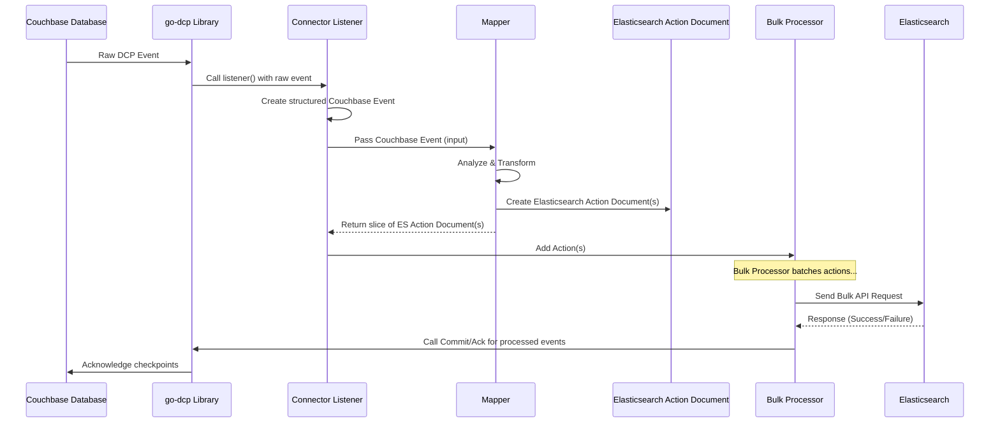

# Chapter 5: Mapper

Welcome back! In the previous chapter, [Chapter 4: Config](04_config_.md), we learned that the Config is the instruction manual telling the Connector *where* to connect (to Couchbase and Elasticsearch) and *which* Couchbase data (`collectionIndexMapping`) should generally go to *which* Elasticsearch index.

But knowing *where* the data comes from and *where* it should go isn't the whole story. What about the data itself?

*   Do you want the Couchbase document's JSON content to be indexed in Elasticsearch exactly as it is?
*   Do you need to transform the data, perhaps remove sensitive fields, add metadata, or change the structure?
*   What if a single change in Couchbase should trigger *more than one* action in Elasticsearch?
*   What if you want to ignore certain documents entirely based on their content?

This is where the **Mapper** comes in.

## What is the Mapper?

The **Mapper** is your custom translator. It's a function you provide to the connector that takes a single [Couchbase Event](01_couchbase_event_.md) as input and decides *what* Elasticsearch action(s) should be performed as a result. It translates the raw Couchbase change into one or more specific instructions ([Elasticsearch Action Document](02_elasticsearch_action_document_.md)s) for Elasticsearch.

Think of it like this:

*   The [Couchbase Event](01_couchbase_event_.md) is the raw data coming from the source ("Document X was added/changed/deleted").
*   The **Mapper** is the logic that says: "Okay, because Document X was added/changed, I should prepare an 'Index' action for Elasticsearch. What should the content (`Source`) of that Elasticsearch document be? What should its ID be?" Or "Because Document X was deleted, I should prepare a 'Delete' action for Elasticsearch. What's its ID in Elasticsearch?"

The Mapper gives you complete control over this transformation and filtering process.

## The Core Use Case: Mapping Simple Changes

The most fundamental use case is mirroring the basic Couchbase operations:

*   A Couchbase **Mutation** (document added or changed) should become an Elasticsearch **Index** action (add or replace).
*   A Couchbase **Deletion** or **Expiration** should become an Elasticsearch **Delete** action.

This is such a common scenario that the `go-dcp-elasticsearch` library provides a built-in **DefaultMapper** that does exactly this.

Let's look at the `DefaultMapper` function's logic (found in `mapper.go`):

```go
// Simplified snippet from mapper.go
// DefaultMapper translates Couchbase mutations to ES Index,
// and deletions/expirations to ES Delete actions.
func DefaultMapper(event couchbase.Event) []document.ESActionDocument {
	// Check if the Couchbase event is a mutation (add/change)
	if event.IsMutated {
		// If it's a mutation, create an Elasticsearch Index action.
		// NewIndexAction takes the Couchbase Key as the ES Document ID,
		// and the Couchbase Value as the ES Document Source.
		action := document.NewIndexAction(event.Key, event.Value, nil)

		// Return a slice containing this single action.
		// The Bulk Processor will later add the correct IndexName
		// based on the Config's CollectionIndexMapping.
		return []document.ESActionDocument{action}

	} else {
		// If it's not a mutation, it must be a deletion or expiration.
		// Create an Elasticsearch Delete action.
		// NewDeleteAction takes the Couchbase Key as the ES Document ID.
		action := document.NewDeleteAction(event.Key, nil)

		// Return a slice containing this single delete action.
		return []document.ESActionDocument{action}
	}
}
```

This is the default behavior. When the Connector's `listener` receives a [Couchbase Event](01_couchbase_event_.md), it passes it to this `DefaultMapper` function. Based on the `IsMutated` flag, the mapper returns either an `Index` action (with the original document content) or a `Delete` action.

## How to Use the Default Mapper (Which is Automatic)

Since the `DefaultMapper` is, well, the default, you don't have to do anything special to use it. As shown in the simple examples from previous chapters (`example/simple/main.go`, `example/default-mapper/main.go`), building the connector without explicitly setting a mapper uses the `DefaultMapper`:

```go
// Simplified snippet from example/simple/main.go
import (
	"github.com/Trendyol/go-dcp-elasticsearch"
	// ... other imports ...
)

// Note: No custom mapper function is explicitly set here.
// The NewConnectorBuilder will use DefaultMapper automatically.

func main() {
	connector, err := dcpelasticsearch.NewConnectorBuilder("config.yml").Build()
	if err != nil {
		panic(err)
	}
	// ... start and defer close ...
}
```

This is the easiest way to get started if you just need to mirror your Couchbase documents to Elasticsearch without modification.

## How to Use a Custom Mapper

The real power of the Mapper comes when you need to customize the behavior. You can provide your own function that matches the `Mapper` signature and tell the Connector to use it instead of the default.

The `Mapper` is simply a function type:

```go
// Snippet from mapper.go
type Mapper func(event couchbase.Event) []document.ESActionDocument
```

This means any Go function that accepts a `couchbase.Event` and returns a slice of `document.ESActionDocument` can be your custom mapper.

You set your custom mapper using the `SetMapper` method on the `ConnectorBuilder`:

```go
// Simplified example showing how to set a custom mapper
package main

import (
	dcpelasticsearch "github.com/Trendyol/go-dcp-elasticsearch"
	"github.com/Trendyol/go-dcp-elasticsearch/couchbase"
	"github.com/Trendyol/go-dcp-elasticsearch/elasticsearch/document"
	// ... other imports ...
)

// Your custom mapper function
func myCustomMapper(event couchbase.Event) []document.ESActionDocument {
	// --- Your custom logic goes here! ---

	if event.IsMutated {
		// Example: Transform the document source
		// You'd typically unmarshal event.Value (which is []byte)
		// modify the Go struct/map, and then remarshal it to []byte
		transformedValue := event.Value // Start with the original

		// *** Example: Simple transformation placeholder ***
		// In a real scenario, you'd do:
		// var docMap map[string]interface{}
		// json.Unmarshal(event.Value, &docMap)
		// docMap["added_field"] = event.EventTime.Unix() // Add a field
		// delete(docMap, "sensitive_field")             // Remove a field
		// transformedValue, _ = json.Marshal(docMap)
		// ***********************************************

		// Create an Index action with the (potentially) transformed value
		action := document.NewIndexAction(event.Key, transformedValue, nil)
		return []document.ESActionDocument{action} // Return the action in a slice

	} else if event.IsDeleted || event.IsExpired {
		// Example: Handle deletion - maybe delete from one index but index a log in another?
		// For simplicity, let's just do the default delete:
		action := document.NewDeleteAction(event.Key, nil)
		return []document.ESActionDocument{action} // Return the delete action

		// Example: Or maybe filter out certain deletes?
		// if string(event.Key) == "document_to_ignore_delete" {
		//     return []document.ESActionDocument{} // Return empty slice to ignore
		// } else {
		//     action := document.NewDeleteAction(event.Key, nil)
		//     return []document.ESActionDocument{action}
		// }

	}

	// If it's an unknown event type or you want to ignore it, return an empty slice.
	return []document.ESActionDocument{}
}

func main() {
	connector, err := dcpelasticsearch.NewConnectorBuilder("config.yml").
		SetMapper(myCustomMapper). // <- Tell the builder to use your function
		Build()
	if err != nil {
		panic(err)
	}
	// ... start and defer close ...
}
```

This example shows the basic structure of a custom mapper:

1.  Define a function that accepts `couchbase.Event` and returns `[]document.ESActionDocument`.
2.  Inside the function, inspect the `event` (especially `IsMutated`, `IsDeleted`, `IsExpired`).
3.  Based on the event, create one or more `document.ESActionDocument` objects using helper functions like `document.NewIndexAction`, `document.NewDeleteAction`, `document.NewDocUpdateAction`, or `document.NewScriptUpdateAction`.
4.  Return the actions as a slice. If you return an empty slice (`[]document.ESActionDocument{}`), no action will be sent to Elasticsearch for this particular [Couchbase Event](01_couchbase_event_.md), and the event will be immediately acknowledged back to Couchbase.

## Advanced Customization Examples

Beyond simple indexing and deletion, a custom mapper can handle more complex scenarios:

*   **Transforming Data:** Unmarshal `event.Value` (which is `[]byte`), manipulate the data (add/remove fields, change values), then remarshal it back to `[]byte` for the `Source` of an `Index` or `DocUpdate` action.
*   **Filtering Documents:** Check conditions based on `event.Key`, `event.Value`, or metadata. If a document doesn't meet criteria, return an empty slice `[]document.ESActionDocument{}` to skip it.
*   **Partial Updates:** Instead of `NewIndexAction` (which replaces the whole document), use `document.NewDocUpdateAction` or `document.NewScriptUpdateAction` for partial updates, sending only the changed parts or a script. The `example/doc-update/main.go` and `example/script-update/main.go` show examples of this.
*   **Multiple Actions:** Return a slice with more than one `ESActionDocument`. For example, if a document represents an "order", you might:
    *   Index the full order document into an `orders` index.
    *   Index a summary into an `order_summaries` index.
    *   Index line items into an `order_items` index.
    *   This requires setting the `IndexName` explicitly when creating the actions using helpers like `document.NewIndexActionWithIndexName`.

```go
// Example: Mapping one Couchbase event to multiple ES actions
func multiActionMapper(event couchbase.Event) []document.ESActionDocument {
	if event.IsMutated {
		var doc map[string]interface{}
		// In a real mapper, handle unmarshal error!
		_ = json.Unmarshal(event.Value, &doc)

		actions := []document.ESActionDocument{}

		// Action 1: Index the full document
		fullAction := document.NewIndexActionWithIndexName("full_orders", event.Key, event.Value, nil)
		actions = append(actions, fullAction)

		// Action 2: Index a summary (requires extracting/transforming data)
		summaryDoc := map[string]interface{}{
			"orderId": string(event.Key),
			"total":   doc["total"], // Example: extract total
			"status":  doc["status"], // Example: extract status
		}
		summaryValue, _ := json.Marshal(summaryDoc) // Remarshal
		summaryAction := document.NewIndexActionWithIndexName("order_summaries", event.Key, summaryValue, nil)
		actions = append(actions, summaryAction)

		// Return all generated actions
		return actions
	}

	// Handle deletion: Maybe delete from both indexes?
	if event.IsDeleted || event.IsExpired {
		deleteFullAction := document.NewDeleteActionWithIndexName("full_orders", event.Key, nil)
		deleteSummaryAction := document.NewDeleteActionWithIndexName("order_summaries", event.Key, nil)
		return []document.ESActionDocument{deleteFullAction, deleteSummaryAction}
	}

	return []document.ESActionDocument{}
}
```
*(Note: The `CollectionIndexMapping` in the Config is often sufficient for simple one-to-one mapping, but a custom mapper allows for more complex mapping logic or sending to multiple indexes from a single collection.)*

## Data Flow with the Mapper

Let's update our flow diagram to explicitly show the Mapper's role after the [Couchbase Event](01_couchbase_event_.md) is created by the Connector's listener.



As you can see, the `Mapper` is the key step where the raw change information (`Couchbase Event`) is converted into the specific instructions (`Elasticsearch Action Document`s) needed for Elasticsearch.

## Summary

In this chapter, we learned about the **Mapper**, the crucial function that translates [Couchbase Event](01_couchbase_event_.md)s into [Elasticsearch Action Document](02_elasticsearch_action_document_.md)s.

We saw that the `go-dcp-elasticsearch` project provides a `DefaultMapper` for the common case of mirroring mutations as index actions and deletions/expirations as delete actions. We also learned how to create and use a custom mapper function using the `SetMapper` method on the `ConnectorBuilder` to implement complex data transformations, filtering, or generating multiple Elasticsearch actions from a single Couchbase event.

The Mapper gives you fine-grained control over *what* data is sent to Elasticsearch and *how* it is formatted.

Now that we understand how [Elasticsearch Action Document](02_elasticsearch_action_document_.md)s are generated by the Mapper, let's look at how the connector efficiently sends these actions to Elasticsearch using the **Bulk Processor**.

[Next Chapter: Bulk Processor](06_bulk_processor_.md)