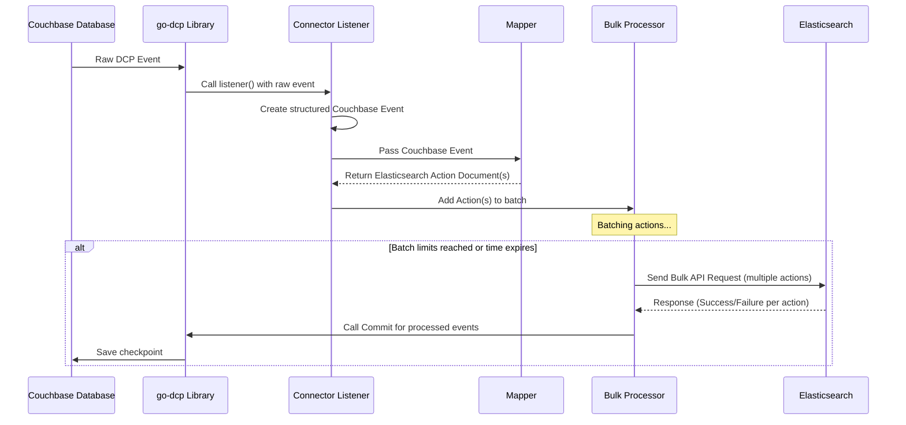

# Chapter 6: Bulk Processor

Welcome back! In our journey so far, we've seen how the `go-dcp-elasticsearch` connector works with raw changes from Couchbase ([Chapter 1: Couchbase Event](01_couchbase_event_.md)), how the [Mapper](05_mapper_.md) translates these changes into specific instructions for Elasticsearch ([Chapter 2: Elasticsearch Action Document](02_elasticsearch_action_document_.md)), and how the [Connector](03_connector_.md) orchestrates this flow using a [Config](04_config_.md).

Now, consider this: If your Couchbase database is very active, you might have hundreds or even thousands of document changes happening every second. If the connector were to send each resulting [Elasticsearch Action Document](02_elasticsearch_action_document_.md) to Elasticsearch individually, it would generate an enormous number of network requests. This would be incredibly inefficient and could quickly overload both your connector and your Elasticsearch cluster.

This is the problem the **Bulk Processor** solves.

## What is the Bulk Processor?

The **Bulk Processor** is like a smart post office for your [Elasticsearch Action Document](02_elasticsearch_action_document_.md)s. Instead of taking each "letter" (an [Elasticsearch Action Document](02_elasticsearch_action_document_.md)) and running to the nearest post box immediately, the Bulk Processor collects multiple letters into a "mailbag" (a batch). It then waits until the mailbag is full enough or until a certain amount of time has passed, and only then does it send the entire mailbag to the main post office (Elasticsearch) in one trip (a single Bulk API request).

Its primary job is to:

1.  **Collect:** Receive [Elasticsearch Action Document](02_elasticsearch_action_document_.md)s generated by the [Mapper](05_mapper.md).
2.  **Batch:** Group these actions together based on configured limits (like number of actions or total size).
3.  **Format:** Convert the batch of actions into the specific format required by Elasticsearch's efficient [Bulk API](https://www.elastic.co/guide/en/elasticsearch/reference/current/docs-bulk.html).
4.  **Send:** Send the formatted batch as a single HTTP request to Elasticsearch using the [Elasticsearch Client](07_elasticsearch_client_.md).
5.  **Manage Checkpoints:** Crucially, after a batch is successfully processed by Elasticsearch, the Bulk Processor tells the underlying `go-dcp` library to commit the checkpoint, acknowledging that the [Couchbase Event](01_couchbase_event_.md)s corresponding to those actions have been successfully replicated.

By sending actions in batches, the Bulk Processor drastically reduces the overhead of making many small network requests, significantly improving the overall performance and throughput of the data replication process.

## Core Use Case: Efficiently Sending Batches

The core use case is automatic and continuous batching of [Elasticsearch Action Document](02_elasticsearch_action_document_.md)s and sending them to Elasticsearch as efficiently as possible. You don't manually interact with the batching process event-by-event in your code. The Bulk Processor handles it in the background.

## How to Configure the Bulk Processor

You don't instantiate the Bulk Processor directly in your main application code. It's created and managed by the [Connector](03_connector_.md). However, you *configure* its behavior using the [Config](04_config_.md).

The relevant settings are found within the `elasticsearch` section of your `config.yml`:

```yaml
elasticsearch:
  # ... other ES settings ...

  # Settings for the Bulk Processor
  batchSizeLimit: 1000        # Maximum number of actions in a batch
  batchTickerDuration: 10s    # Maximum time to wait before sending a batch
  batchByteSizeLimit: 10mb    # Maximum size of a batch in bytes
  concurrentRequest: 5        # Number of batches to send concurrently

  # Optional: How often to commit checkpoints back to Couchbase
  # This can be different from the batch sending frequency
  # batchCommitTickerDuration: 5s # Checkpoint frequency (if different from batchTickerDuration)
```

Let's look at what these settings mean:

| Config Field          | Description                                                                                                                               | Default      |
| :-------------------- | :---------------------------------------------------------------------------------------------------------------------------------------- | :----------- |
| `batchSizeLimit`      | The maximum number of [Elasticsearch Action Document](02_elasticsearch_action_document_.md)s to collect before sending a batch.          | 1000         |
| `batchTickerDuration` | The maximum amount of time to wait (since the last batch was sent) before sending the current batch, regardless of its size.           | 10 seconds   |
| `batchByteSizeLimit`  | The maximum total byte size of the requests in a batch before sending. This prevents sending batches that are too large for Elasticsearch. | 10 MB        |
| `concurrentRequest`   | How many batches the Bulk Processor is allowed to send to Elasticsearch at the *same time*. Increasing this can improve throughput.    | 1            |
| `batchCommitTickerDuration` | An optional setting to control how often checkpoints are committed back to Couchbase. If set, checkpoints happen on this interval. If not set, checkpoints happen whenever a batch is successfully sent based on `batchTickerDuration`. | nil (commits with batch ticker) |

The Bulk Processor will send a batch whenever *any* of these limits are reached (size, byte size, or time).

## How the Connector Uses the Bulk Processor

As we saw in [Chapter 3: Connector](03_connector_.md), the Connector's `listener` function receives [Couchbase Event](01_couchbase_event_.md)s, passes them to the [Mapper](05_mapper_.md), gets back [Elasticsearch Action Document](02_elasticsearch_action_document_.md)s, and then hands these actions to the Bulk Processor.

Here's the relevant snippet from the `listener` (simplified from `connector.go`):

```go
// Simplified snippet from connector.go listener function
func (c *connector) listener(ctx *models.ListenerContext) {
	// ... (code to create couchbaseEvent from ctx.Event) ...

	// Use the configured mapper to get ES actions
	esActions := c.mapper(couchbaseEvent)

	if len(esActions) == 0 {
		ctx.Ack() // No actions? Acknowledge immediately.
		return
	}

	// --- Pass actions to the Bulk Processor ---
	// Add the generated actions to the Bulk Processor's queue
	// 'true' at the end indicates this is the last chunk for this event
	c.bulk.AddActions(ctx, couchbaseEvent.EventTime, esActions, couchbaseEvent.CollectionName, true)

	// ctx.Ack() is NOT called here. The Bulk Processor will call it
	// after the batch containing these actions is sent successfully.
}
```

When `c.bulk.AddActions(...)` is called:

1.  The Bulk Processor receives the slice of `esActions`.
2.  It adds each action to its internal batch queue.
3.  It calculates the Elasticsearch index name for each action based on the Couchbase Collection name and the `collectionIndexMapping` from the [Config](04_config_.md) (if not already specified by the [Mapper](05_mapper_.md)).
4.  It formats each action into the newline-delimited JSON needed for the Bulk API.
5.  It checks if adding these actions triggered any of the batch limits (`batchSizeLimit`, `batchByteSizeLimit`).
6.  If a limit is reached *or* if the `batchTickerDuration` timer expires, it triggers a batch send (`bulkRequest`).

Notice the comment: `ctx.Ack()` is *not* called immediately in the listener. This is crucial for reliable replication. The Bulk Processor handles the acknowledgment only *after* Elasticsearch confirms it has processed the batch containing those actions. This ensures that if the application stops unexpectedly after receiving an event but before sending it to Elasticsearch, that event will be replayed from Couchbase upon restart.

## Inside the Bulk Processor

Let's peek at the structure of the `Bulk` processor (`elasticsearch/bulk/bulk.go`).

```go
// Simplified snippet from elasticsearch/bulk/bulk.go
type Bulk struct {
	// Configuration settings
	config                 *config.Config
	collectionIndexMapping map[string]string // From config
	batchSizeLimit         int               // From config
	batchByteSizeLimit     int               // From config
	batchTickerDuration    time.Duration     // From config
	concurrentRequest      int               // From config

	// Internal state for batching
	batch     []BatchItem // The current batch of items
	batchSize int         // Current number of actions in batch
	batchByteSize int     // Current byte size of batch
	batchKeys map[string]int // Helper to track items for updates/deletes

	// Timers
	batchTicker         *time.Ticker // Timer for batchTickerDuration
	batchCommitTicker *time.Ticker // Optional timer for checkpoints

	// Communication channels/clients
	actionCh chan document.ESActionDocument // Channel where actions arrive (used differently in simplified flow above)
	esClient *elasticsearch.Client // The Elasticsearch client
	dcpCheckpointCommit func() // Function provided by go-dcp to commit checkpoints

	// Sync & State
	flushLock sync.Mutex // Protects batch manipulation
	isDcpRebalancing bool // State during Couchbase rebalancing
	// ... other fields for metrics, response handling, etc.
}

// BatchItem holds an action and its formatted bytes
type BatchItem struct {
	Action *document.ESActionDocument
	Bytes  []byte // The action formatted for ES Bulk API
}
```

Key fields here:

*   Configuration settings are stored.
*   `batch`, `batchSize`, `batchByteSize` track the current batch being built.
*   `batchTicker` and `batchCommitTicker` drive the time-based triggers.
*   `esClient` is used to actually send the request.
*   `dcpCheckpointCommit` is the function called to signal successful processing back to Couchbase.
*   `flushLock` is essential to prevent multiple Go routines (potentially triggered by the ticker and size limits happening close together) from trying to modify the batch at the same time.

When `AddActions` is called, it adds the incoming actions to the `batch` slice, updates `batchSize` and `batchByteSize`, and then checks if the limits are met, potentially calling `flushMessages()`.

The `flushMessages()` function (simplified):

```go
// Simplified snippet from elasticsearch/bulk/bulk.go
func (b *Bulk) flushMessages() {
	b.flushLock.Lock() // Acquire lock before accessing batch state
	defer b.flushLock.Unlock()

	if b.isDcpRebalancing {
		// Don't send batches during rebalancing
		return
	}

	if len(b.batch) > 0 {
		// --- Step 1: Prepare and send the bulk request ---
		err := b.bulkRequest() // Formats batch, sends via esClient

		// --- Step 2: Handle response (success/failure) ---
		// If err, or response contains errors, logs/handles via SinkResponseHandler
		// Also updates success/error metrics

		// --- Step 3: Reset batch state ---
		// Clear the batch slices, reset sizes
		b.batch = b.batch[:0]
		b.batchKeys = make(map[string]int, b.batchSizeLimit) // Reset map too
		b.batchIndex = 0
		b.batchSize = 0
		b.batchByteSize = 0

		// --- Step 4: Reset the time ticker ---
		// Start the timer again for the *next* batch
		b.batchTicker.Reset(b.batchTickerDuration)

		// --- Step 5: Checkpoint ---
		b.CheckAndCommit() // May call dcpCheckpointCommit()
	}
	// If batch is empty, do nothing
}
```

The `bulkRequest()` method (simplified, uses `errgroup` for concurrency):

```go
// Simplified snippet from elasticsearch/bulk/bulk.go
func (b *Bulk) bulkRequest() error {
	// Group batch items into chunks based on concurrentRequest setting
	chunks := helpers.ChunkSlice(b.batch, b.concurrentRequest)

	// Use errgroup to send chunks concurrently
	eg, _ := errgroup.WithContext(context.Background())

	for i, chunk := range chunks {
		if len(chunk) > 0 {
			// Launch a goroutine for each chunk
			eg.Go(b.requestFunc(i, chunk)) // requestFunc formats & sends a single chunk
		}
	}

	// Wait for all concurrent requests to complete
	err := eg.Wait()

	// Process responses and finalize actions (metrics, sink handler)
	// ... (calls finalizeProcess for each action in the original batch) ...

	return err // Return combined error if any occurred
}
```

This shows that `bulkRequest` handles sending parts of the batch concurrently using `requestFunc` and `errgroup`, improving throughput to Elasticsearch. The `finalizeProcess` method (called after waiting for all requests) is responsible for updating metrics and calling the [Sink Response Handler](08_sink_response_handler_.md) for each individual action based on the Elasticsearch response for that batch.

Finally, the `CheckAndCommit()` method handles checkpointing:

```go
// Simplified snippet from elasticsearch/bulk/bulk.go
func (b *Bulk) CheckAndCommit() {
	// If batchCommitTickerDuration is set, commit only when that ticker fires
	if b.batchCommitTicker != nil {
		select {
		case <-b.batchCommitTicker.C:
			b.dcpCheckpointCommit() // Call the go-dcp commit function
		default:
			// Ticker hasn't fired, do nothing
			return
		}
	} else {
		// If batchCommitTickerDuration is NOT set, commit on every flush
		b.dcpCheckpointCommit() // Call the go-dcp commit function
	}
}
```

This function shows how the Bulk Processor interacts with `go-dcp` via the `dcpCheckpointCommit` function provided by the [Connector](03_connector_.md) to commit checkpoints, saving the progress back to Couchbase.

## Data Flow with the Bulk Processor

Let's refine our sequence diagram to show the Bulk Processor receiving actions, sending the batch, and then signaling the checkpoint.



This diagram clearly illustrates how the Bulk Processor receives individual actions from the Connector's listener, groups them, and then sends a single request representing the entire batch to Elasticsearch. Only *after* Elasticsearch responds does the Bulk Processor interact with `go-dcp` to commit the checkpoint, linking successful writes in Elasticsearch to progress acknowledged in Couchbase.

## Summary

In this chapter, we learned about the **Bulk Processor**, a key component for efficient data replication. Its role is to collect [Elasticsearch Action Document](02_elasticsearch_action_document_.md)s generated by the [Mapper](05_mapper.md), batch them according to size and time limits defined in the [Config](04_config.md), format them for Elasticsearch's Bulk API, and send them as single requests. This significantly reduces overhead compared to sending individual actions.

We saw that the Bulk Processor is configured via the `elasticsearch` section of the [Config](04_config.md) and how the [Connector](03_connector.md) passes actions to it. We also got a glimpse inside the Bulk Processor, understanding its internal state, how it uses timers and limits to trigger batch sends, and how it interacts with the underlying `go-dcp` library to manage reliable checkpointing *after* Elasticsearch processing.

Now that we understand how actions are batched and the Bulk Processor's role, let's look at the component it uses to communicate directly with Elasticsearch: the **Elasticsearch Client**.

[Next Chapter: Elasticsearch Client](07_elasticsearch_client_.md)