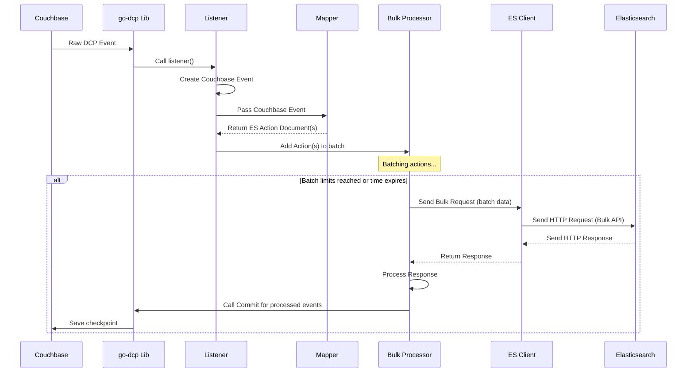

# Chapter 7: Elasticsearch Client

Welcome back! In the previous chapter, [Chapter 6: Bulk Processor](06_bulk_processor_.md), we learned how the Bulk Processor efficiently collects multiple [Elasticsearch Action Document](02_elasticsearch_action_document_.md)s into batches before sending them. This is much better than sending each change individually.

But once the Bulk Processor has a ready batch, how does it actually get that batch to your Elasticsearch cluster? This involves making a network connection, sending data over HTTP, and receiving the response. Handling these technical details for every batch would complicate the Bulk Processor's job.

This is where the **Elasticsearch Client** comes in.

## What is the Elasticsearch Client?

The **Elasticsearch Client** is the dedicated component responsible for handling the *actual communication* with your Elasticsearch cluster over the network. It's the bridge between the `go-dcp-elasticsearch` connector (specifically the [Bulk Processor](06_bulk_processor.md)) and the Elasticsearch API endpoint.

Think of the [Bulk Processor](06_bulk_processor.md) as the person who packs the mailbag, and the **Elasticsearch Client** as the reliable delivery service that takes the packed mailbag and delivers it to the Elasticsearch post office.

Its primary job is straightforward:

1.  **Establish Connection:** Manage the network connection(s) to the Elasticsearch cluster URLs specified in the [Config](04_config.md).
2.  **Send Requests:** Take the formatted batch data (the newline-delimited JSON prepared by the [Bulk Processor](06_bulk_processor.md)) and send it as an HTTP POST request to Elasticsearch's Bulk API endpoint.
3.  **Handle Responses:** Receive the HTTP response from Elasticsearch, including success/failure status for the batch and details about individual actions within the batch.
4.  **Manage Transport:** Handle lower-level network details like connection pooling, retries, and potentially using an optimized HTTP library.

The **Elasticsearch Client** hides the complexity of network communication, allowing the [Bulk Processor](06_bulk_processor.md) to focus solely on the logic of batching and coordinating checkpoints.

## Core Use Case: Sending the Bulk Request

The central use case is simple: The [Bulk Processor](06_bulk_processor.md) prepares a batch of actions as a block of data (a `[]byte` slice or similar structure that can be read). It then hands this data to the **Elasticsearch Client** and tells it to "send this to the Bulk API".

The client sends the data and returns the response received from Elasticsearch.

## How to Use the Elasticsearch Client (Via Configuration)

You typically do *not* directly interact with the `Elasticsearch Client` in your custom code (like your [Mapper](05_mapper.md) or [Sink Response Handler](08_sink_response_handler.md)). The client instance is created and managed internally by the [Connector](03_connector.md) during its setup phase.

You influence the **Elasticsearch Client**'s behavior and tell it *where* to connect by providing the necessary details in the [Config](04_config.md) file.

Here are the key configuration settings in the `elasticsearch` section that are directly used to configure the client:

```yaml
elasticsearch:
  # Addresses of your Elasticsearch cluster
  urls:
    - "http://localhost:9200" # Or "https://..."

  # Authentication for Elasticsearch (if needed)
  username: your_es_username
  password: your_es_password

  # *** Settings that configure the underlying HTTP client ***
  maxConnsPerHost: 10         # Max concurrent connections per Elasticsearch node
  maxIdleConnDuration: 30s    # How long to keep idle connections open
  compressionEnabled: true    # Enable gzip compression for requests

  # Settings for discovering nodes (important in clusters)
  discoverNodesOnStart: true  # Attempt to discover nodes on startup
  discoverNodesInterval: 5m   # How often to rediscover nodes

  # ... other ES settings (batching, mapping, etc.) ...
```

These settings control things like:

| Config Field            | Description                                                                                                |
| :---------------------- | :--------------------------------------------------------------------------------------------------------- |
| `urls`                  | A list of Elasticsearch cluster node addresses to connect to.                                              |
| `username`, `password`  | Credentials for basic HTTP authentication with Elasticsearch.                                                |
| `maxConnsPerHost`       | Limits the number of parallel HTTP connections the client can open to a *single* Elasticsearch node.       |
| `maxIdleConnDuration`   | How long an unused (idle) network connection to Elasticsearch should be kept alive before closing it.      |
| `compressionEnabled`    | Whether to compress the request body (the batch data) using gzip before sending, saving bandwidth.         |
| `discoverNodesOnStart`  | If true, the client will try to find all nodes in the cluster upon starting.                               |
| `discoverNodesInterval` | If discovery is enabled, this sets how often the client should poll the cluster to see if nodes have changed. |

When you call `NewConnectorBuilder(...).Build()`, the connector reads these settings from your [Config](04_config.md) and passes them to the internal logic that creates the `Elasticsearch Client` instance.

## How the Bulk Processor Uses the Client

Once the [Bulk Processor](06_bulk_processor.md) has assembled a batch and formatted it, it calls a method on the `Elasticsearch Client` instance it holds to send the data.

Looking back at the simplified `bulkRequest` function in the [Bulk Processor](06_bulk_processor.md) ([Chapter 6](06_bulk_processor.md), `elasticsearch/bulk/bulk.go`):

```go
// Simplified snippet from elasticsearch/bulk/bulk.go
func (b *Bulk) requestFunc(concurrentRequestIndex int, batchItems []BatchItem) func() error {
	return func() error {
		// ... (code to get the formatted batch data into a reader) ...
		reader := b.readers[concurrentRequestIndex]
		reader.Reset(getBytes(batchItems)) // Prepare the data to be read

		// --- THE BULK PROCESSOR CALLS THE ELASTICSEARCH CLIENT HERE ---
		r, err := b.esClient.Bulk(reader)
		// --- Client sends request and returns response ---

		if err != nil {
			// Handle network error from the client
			// ... (finalize process with error) ...
			return err
		}
		// Handle response error reported by Elasticsearch (HTTP OK, but errors in batch)
		// errorData, err := hasResponseError(r)
		// b.finalizeProcess(actionsOfBatchItems, errorData)

		// ... (more response handling) ...
		return nil
	}
}
```

This shows that the `Bulk` processor instance has a field `esClient` which is the `Elasticsearch Client`. It uses this field to call the `Bulk` method, passing the batch data (`reader`). The `esClient.Bulk` method is part of the underlying `elastic/go-elasticsearch/v7` library's API. This is where the actual HTTP request is built and sent over the network to the Elasticsearch cluster.

## Inside the Elasticsearch Client Implementation

The `go-dcp-elasticsearch` project uses the official Go client library for Elasticsearch: `github.com/elastic/go-elasticsearch/v7`. The `Elasticsearch Client` component (`elasticsearch/client/client.go`) is essentially a wrapper around this library, configuring it based on the `go-dcp-elasticsearch` [Config](04_config.md).

Let's look at the simplified `NewElasticClient` function:

```go
// Simplified snippet from elasticsearch/client/client.go
package client

import (
	"math" // Used for MaxRetries, essentially infinite
	"github.com/Trendyol/go-dcp-elasticsearch/config" // Import our config type
	"github.com/elastic/go-elasticsearch/v7" // Import the official ES client library
	// ... other imports ...
)

func NewElasticClient(config *config.Config) (*elasticsearch.Client, error) {
	// Create a new client instance using the official library
	es, err := elasticsearch.NewClient(elasticsearch.Config{
		Username:              config.Elasticsearch.Username, // From our config
		Password:              config.Elasticsearch.Password, // From our config
		Addresses:             config.Elasticsearch.Urls,     // From our config
		CompressRequestBody:   config.Elasticsearch.CompressionEnabled, // From our config
		DiscoverNodesOnStart:  !config.Elasticsearch.DisableDiscoverNodesOnStart, // From our config
		DiscoverNodesInterval: *config.Elasticsearch.DiscoverNodesInterval, // From our config

		// Custom transport for better performance (using fasthttp)
		Transport: newTransport(config.Elasticsearch),

		// Custom logger adapter to integrate with go-dcp logger
		Logger: &LoggerAdapter{Logger: logger.Log},

		MaxRetries:            math.MaxInt, // Retry requests indefinitely on network errors
		// ... other standard ES client config ...
	})
	if err != nil {
		// Handle potential errors during client creation
		return nil, err
	}
	return es, nil // Return the configured client instance
}
```

This code shows:

1.  The function takes our project's `config.Config` as input.
2.  It creates a configuration object specifically for the `elastic/go-elasticsearch/v7` library (`elasticsearch.Config`).
3.  It populates the `elasticsearch.Config` fields using the corresponding values from our `go-dcp-elasticsearch` `config.Config` (like `Urls`, `Username`, `Password`, `CompressionEnabled`, etc.).
4.  It sets a custom `Transport`. The project uses `fasthttp` instead of the standard Go HTTP client for potentially better performance (`elasticsearch/client/fasthttp_transport.go`). The `newTransport` function takes the `config.Elasticsearch` section to apply settings like `MaxConnsPerHost` and `MaxIdleConnDuration` to this custom transport.
5.  It provides a custom `Logger`. The `LoggerAdapter` (`elasticsearch/client/log.go`) ensures that any logging done by the underlying `elastic/go-elasticsearch/v7` client is routed through the standard `go-dcp` logger used by the project.
6.  Finally, it calls `elasticsearch.NewClient` with this configuration and returns the resulting client instance.

This client instance is then passed to the [Bulk Processor](06_bulk_processor.md) during the [Connector](03_connector.md)'s initialization, making it available for sending bulk requests.

## Data Flow with the Elasticsearch Client

Let's add the Elasticsearch Client explicitly to our sequence diagram, showing its interaction with the Bulk Processor and the Elasticsearch cluster.



This diagram shows that the Bulk Processor doesn't talk directly to Elasticsearch over the network. It delegates this task to the **Elasticsearch Client**, which handles the actual HTTP communication.

## Summary

In this chapter, we learned about the **Elasticsearch Client**. It's the crucial component that manages the network connection and sends data (specifically the batches prepared by the [Bulk Processor](06_bulk_processor.md)) to your Elasticsearch cluster using HTTP requests. It uses the official `elastic/go-elasticsearch/v7` library internally, configured via settings like `urls`, `username`, `password`, and transport parameters in the `elasticsearch` section of your [Config](04_config.md).

While you don't directly use the client in your code, understanding its role helps clarify how the batched data makes its way to Elasticsearch.

Now that we know how the Bulk Processor sends data using the Elasticsearch Client, what happens *after* Elasticsearch processes the batch and sends back a response? How does the connector handle success, failure, or errors for individual documents within that batch? That's the responsibility of the **Sink Response Handler**.

[Next Chapter: Sink Response Handler](08_sink_response_handler_.md)