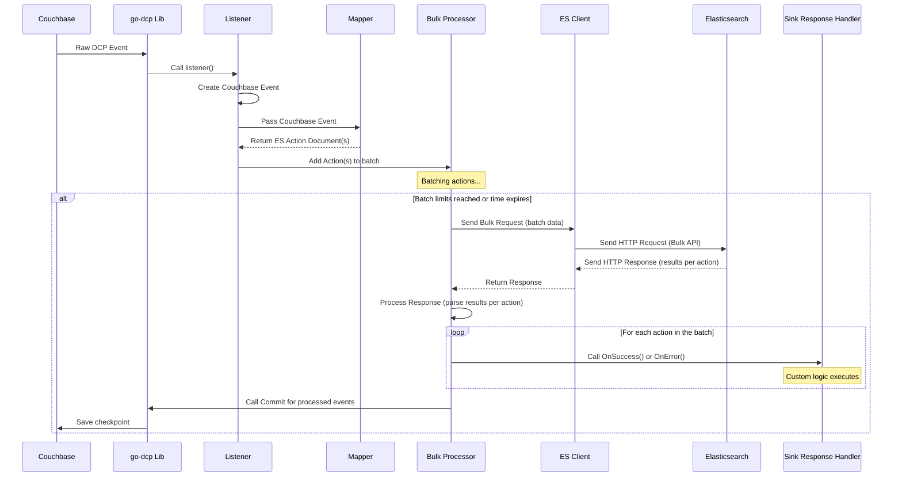

# Chapter 8: Sink Response Handler

Welcome back! In the last chapter, [Chapter 7: Elasticsearch Client](07_elasticsearch_client_.md), we saw how the [Bulk Processor](06_bulk_processor_.md) uses the **Elasticsearch Client** to send batches of [Elasticsearch Action Document](02_elasticsearch_action_document_.md)s to Elasticsearch over the network.

After the **Elasticsearch Client** sends the batch, Elasticsearch processes it and sends back a response. This response isn't just a simple "success" or "failure" for the *entire batch*. Elasticsearch's Bulk API response contains detailed results for *each individual action* within the batch. Some actions might succeed, while others might fail (e.g., due to mapping issues, validation errors, etc.).

While the [Bulk Processor](06_bulk_processor_.md) internally processes this response to update metrics and manage checkpoints, what if you want to do something *custom* based on the success or failure of an individual document's action? Maybe you want to log failed documents to a specific file, send an alert, or save the rejected documents to a separate Elasticsearch index for later inspection.

This is where the **Sink Response Handler** comes in.

## What is the Sink Response Handler?

The **Sink Response Handler** is a mechanism that allows you to **hook into the result of each individual Elasticsearch action** after a batch has been processed. The [Bulk Processor](06_bulk_processor_.md) iterates through the results from the Elasticsearch Bulk API response and, for every single action it sent, it calls methods on your configured **Sink Response Handler**.

Think of the [Bulk Processor](06_bulk_processor_.md) as getting a detailed receipt back from the Elasticsearch post office after sending a mailbag. The **Sink Response Handler** is your assistant who goes through that receipt item by item ("Okay, this letter to Alice? Delivered! This one to Bob? Address problem, couldn't deliver.").

Its primary job is to provide callbacks that you can implement:

*   A method that is called for each action that **successfully** completed in Elasticsearch.
*   A method that is called for each action that **failed** in Elasticsearch, providing details about the error.

This allows you to react specifically to the outcome for *each document* you tried to replicate.

## Core Use Case: Reacting to Individual Action Results

The central use case is implementing custom logic for documents based on whether their corresponding Elasticsearch action succeeded or failed.

A very common example of this is **logging rejected documents**. If Elasticsearch rejects a document (e.g., because its content doesn't match the index mapping), you want to know which document failed and why. The `go-dcp-elasticsearch` project includes a built-in **Rejection Log Sink Response Handler** specifically for this purpose, which logs these failed documents into a dedicated Elasticsearch index.

## The Sink Response Handler Interface

The Sink Response Handler is defined by a Go interface (`elasticsearch/sink_response_handler.go`). An interface is a contract that specifies a set of methods. To create your own handler, you create a Go type (usually a struct) and implement all the methods defined in the interface.

Here's the interface definition:

```go
// Simplified snippet from elasticsearch/sink_response_handler.go
package elasticsearch

import (
	"github.com/Trendyol/go-dcp-elasticsearch/config"
	"github.com/Trendyol/go-dcp-elasticsearch/elasticsearch/document"
	"github.com/elastic/go-elasticsearch/v7"
)

// SinkResponseHandlerContext provides details about the action result
type SinkResponseHandlerContext struct {
	Action *document.ESActionDocument // The original action document
	Err    error                      // The error if it failed (nil on success)
}

// SinkResponseHandlerInitContext provides context during handler initialization
type SinkResponseHandlerInitContext struct {
	Config              *config.Config              // The overall configuration
	ElasticsearchClient *elasticsearch.Client // The Elasticsearch client instance
}

// SinkResponseHandler defines the interface for handling per-action results
type SinkResponseHandler interface {
	// OnSuccess is called for each action that successfully completed
	OnSuccess(ctx *SinkResponseHandlerContext)

	// OnError is called for each action that failed
	OnError(ctx *SinkResponseHandlerContext)

	// OnInit is called once when the Bulk Processor is initialized
	OnInit(ctx *SinkResponseHandlerInitContext)
}
```

Let's break this down:

*   `SinkResponseHandlerContext`: This struct is passed to `OnSuccess` and `OnError`. It contains the original `ESActionDocument` that was sent (`ctx.Action`) and, importantly, an `Err` field which will hold the error details if `OnError` is called.
*   `SinkResponseHandlerInitContext`: This struct is passed *once* to `OnInit` when the connector starts. It provides the handler access to the overall `Config` and the shared `ElasticsearchClient`, which can be useful for complex handlers (like the Rejection Log handler needing the client to write logs).
*   `OnSuccess(ctx *SinkResponseHandlerContext)`: You implement this method to define what happens when an individual action (Index, Delete, Update) succeeds in Elasticsearch.
*   `OnError(ctx *SinkResponseHandlerContext)`: You implement this method to define what happens when an individual action fails. The `ctx.Err` field will contain the reason for the failure reported by Elasticsearch.
*   `OnInit(ctx *SinkResponseHandlerInitContext)`: You can use this method for any setup your handler needs, like checking/creating an index if it writes to Elasticsearch, or initializing a file logger.

## How to Use a Custom Sink Response Handler

To use your own custom handler, you first create a type that implements the `SinkResponseHandler` interface, and then you provide an instance of your type to the `ConnectorBuilder`.

Here's a simple example (similar to `example/simple-sink-response-handler/main.go`) that just prints success/error messages to the console:

```go
// Simplified example from example/simple-sink-response-handler/main.go
package main

import (
	"fmt"
	dcpelasticsearch "github.com/Trendyol/go-dcp-elasticsearch"
	"github.com/Trendyol/go-dcp-elasticsearch/elasticsearch" // Import the ES package
	// ... other imports (like mapper, config) ...
)

// Define your custom struct that will implement the interface
type ConsoleSinkResponseHandler struct {
	// Add fields if your handler needs state (e.g., a file handle)
}

// Implement the OnInit method
func (h *ConsoleSinkResponseHandler) OnInit(ctx *elasticsearch.SinkResponseHandlerInitContext) {
	// This is called once during startup.
	// You could use ctx.Config or ctx.ElasticsearchClient here if needed.
	fmt.Println("ConsoleSinkResponseHandler initialized!")
}

// Implement the OnSuccess method
func (h *ConsoleSinkResponseHandler) OnSuccess(ctx *elasticsearch.SinkResponseHandlerContext) {
	// This is called for each successful action
	fmt.Printf("SUCCESS: Action %s on Document ID %s for Index %s\n",
		string(ctx.Action.Type), string(ctx.Action.ID), ctx.Action.IndexName)
}

// Implement the OnError method
func (h *ConsoleSinkResponseHandler) OnError(ctx *elasticsearch.SinkResponseHandlerContext) {
	// This is called for each failed action
	fmt.Printf("ERROR: Action %s on Document ID %s for Index %s failed: %v\n",
		string(ctx.Action.Type), string(ctx.Action.ID), ctx.Action.IndexName, ctx.Err)
}

func main() {
	// ... (Mapper function definition, etc.) ...

	connector, err := dcpelasticsearch.NewConnectorBuilder("config.yml").
		// Set your custom mapper if needed...
		// SetMapper(myMapperFunction).
		// --- Provide an instance of your custom handler ---
		SetSinkResponseHandler(&ConsoleSinkResponseHandler{}). // Create an instance!
		Build()
	if err != nil {
		panic(err)
	}

	defer connector.Close()
	connector.Start()
}
```

To use your handler:

1.  Define a struct (e.g., `ConsoleSinkResponseHandler`).
2.  Implement the `OnInit`, `OnSuccess`, and `OnError` methods on that struct.
3.  When building the Connector using `NewConnectorBuilder`, call `SetSinkResponseHandler` and pass a *pointer* to an instance of your struct (e.g., `&ConsoleSinkResponseHandler{}`).

Now, whenever the [Bulk Processor](06_bulk_processor_.md) receives results from Elasticsearch, it will call the appropriate method (`OnSuccess` or `OnError`) on your `&ConsoleSinkResponseHandler{}` instance for each action.

## The Built-in Rejection Log Sink Response Handler

Logging failed documents to Elasticsearch is a common requirement. The `go-dcp-elasticsearch` project provides a ready-to-use implementation: `RejectionLogSinkResponseHandler`.

Its `OnError` method formats the details of the failed action (original index, document ID, action type, error message, and optionally the source document) and indexes this information into a designated Elasticsearch index.

You configure the Rejection Log handler in the `elasticsearch` section of your [Config](04_config_.md):

```yaml
elasticsearch:
  # ... other ES settings ...

  rejectionLog:
    index: cbes-rejections  # The ES index name to log errors into
    includeSource: true     # Whether to include the original document source in the log
```

The `index` field specifies the name of the Elasticsearch index where rejection logs will be stored. The `includeSource` field controls whether the original JSON content of the document that failed should be included in the log document (useful for debugging).

To use the built-in Rejection Log handler, you simply create an instance using its constructor function and pass it to the builder (similar to `example/simple-rejection-log-sink-response-handler/main.go`):

```go
// Simplified example from example/simple-rejection-log-sink-response-handler/main.go
package main

import (
	"github.com/Trendyol/go-dcp-elasticsearch"
	"github.com/Trendyol/go-dcp-elasticsearch/elasticsearch" // Import the ES package
	// ... other imports (like mapper, config) ...
)

func main() {
	// ... (Mapper function definition, etc.) ...

	connector, err := dcpelasticsearch.NewConnectorBuilder("config.yml").
		// Set your custom mapper if needed...
		// SetMapper(myMapperFunction).
		// --- Provide an instance of the built-in Rejection Log handler ---
		SetSinkResponseHandler(elasticsearch.NewRejectionLogSinkResponseHandler()).
		Build()
	if err != nil {
		panic(err)
	}

	defer connector.Close()
	connector.Start()
}
```

The `NewRejectionLogSinkResponseHandler()` function creates and returns a handler instance that implements the interface. The `OnInit` method of this handler will automatically check if the configured rejection log index exists and create it if necessary. The `OnError` method will then log failed actions to this index.

If you don't call `SetSinkResponseHandler`, the connector will run without any specific handler for individual action results (though the [Bulk Processor](06_bulk_processor_.md) will still log basic batch errors).

## Inside the Implementation (Bulk Processor's `finalizeProcess`)

The **Sink Response Handler** is primarily called by the [Bulk Processor](06_bulk_processor_.md). As we briefly saw in [Chapter 6: Bulk Processor](06_bulk_processor_.md), after the [Bulk Processor](06_bulk_processor_.md) sends a batch via the [Elasticsearch Client](07_elasticsearch_client_.md) and receives the response, it calls its internal `finalizeProcess` method.

This method's job is to look at the detailed results for each action within the batch and then trigger the appropriate calls to the configured `SinkResponseHandler`.

Here's a simplified look at the relevant part of the `finalizeProcess` function (`elasticsearch/bulk/bulk.go`):

```go
// Simplified snippet from elasticsearch/bulk/bulk.go
func (b *Bulk) finalizeProcess(batchActions []*document.ESActionDocument, errorData map[string]string) {
	// errorData is a map where keys are action identifiers (like "id:index")
	// and values are the error details from the ES response.

	// Iterate through each original action that was in the batch
	for _, action := range batchActions {
		// Create a unique key for this action (combines ID and IndexName)
		key := getActionKey(*action) // Helper function to create a key

		// Check if this action's key exists in the errorData map
		if errorDetails, ok := errorData[key]; ok {
			// --- This action FAILED ---
			go b.countError(action) // Update internal error metrics

			// *** Call the handler's OnError method! ***
			// Only call if a handler was provided when building the connector
			if b.sinkResponseHandler != nil {
				b.sinkResponseHandler.OnError(&elasticsearch.SinkResponseHandlerContext{
					Action: action,             // Pass the original action
					Err:    fmt.Errorf(errorDetails), // Pass the error details
				})
			}

		} else {
			// --- This action SUCCEEDED ---
			go b.countSuccess(action) // Update internal success metrics

			// *** Call the handler's OnSuccess method! ***
			// Only call if a handler was provided
			if b.sinkResponseHandler != nil {
				b.sinkResponseHandler.OnSuccess(&elasticsearch.SinkResponseHandlerContext{
					Action: action, // Pass the original action
					// Err is nil in this context
				})
			}
		}
	}
}
```

This snippet shows the core logic:

1.  `finalizeProcess` takes the original slice of actions (`batchActions`) and a map of errors (`errorData`) derived from the Elasticsearch response.
2.  It loops through each `action` in `batchActions`.
3.  For each `action`, it checks if an error for that specific action exists in the `errorData` map.
4.  If an error is found, it calls `b.sinkResponseHandler.OnError`, passing a `SinkResponseHandlerContext` containing the action and the error details.
5.  If no error is found, it calls `b.sinkResponseHandler.OnSuccess`, passing a `SinkResponseHandlerContext` with the action (and a `nil` error).
6.  The calls are wrapped in `go` routines (`go b.countError`, `go b.countSuccess`) and the handler calls are also typically handled asynchronously by the handler implementation itself to avoid blocking the Bulk Processor's main loop.

This process happens for every batch processed by the [Bulk Processor](06_bulk_processor_.md), allowing your custom handler to receive feedback on each individual document replication attempt.

## Data Flow with the Sink Response Handler

Let's add the Sink Response Handler to our overall sequence diagram. It fits in after the Bulk Processor receives the response and before the checkpoint is committed.



This diagram illustrates that the Sink Response Handler is the final step in the processing pipeline for a given document change (before checkpointing). It receives feedback from the Bulk Processor about the success or failure of the action corresponding to that document change.

## Summary

In this final concept chapter, we explored the **Sink Response Handler**. We learned that it's an interface you can implement to define custom logic that executes after each individual Elasticsearch action within a bulk batch is processed. The [Bulk Processor](06_bulk_processor_.md) calls the handler's `OnSuccess` or `OnError` methods for each action, providing details via the `SinkResponseHandlerContext`.

This allows you to react precisely to the outcome of replicating specific documents, enabling features like custom error logging, alerting, or post-processing based on success or failure. We saw how to implement a custom handler and how to use the convenient built-in `RejectionLogSinkResponseHandler` for logging failed documents into Elasticsearch.

By providing a **Config** ([Chapter 4](04_config_.md)), implementing a **Mapper** ([Chapter 5](05_mapper_.md)), and optionally implementing a **Sink Response Handler** ([Chapter 8](08_sink_response_handler_.md)), you can fully customize the behavior of the `go-dcp-elasticsearch` **Connector** ([Chapter 3](03_connector_.md)), which orchestrates the flow of **Couchbase Events** ([Chapter 1](01_couchbase_event_.md)) converted into **Elasticsearch Action Documents** ([Chapter 2](02_elasticsearch_action_document_.md)), efficiently processed by the **Bulk Processor** ([Chapter 6](06_bulk_processor_.md)) using the **Elasticsearch Client** ([Chapter 7](07_elasticsearch_client_.md)).

This concludes our journey through the core concepts of the `go-dcp-elasticsearch` project!