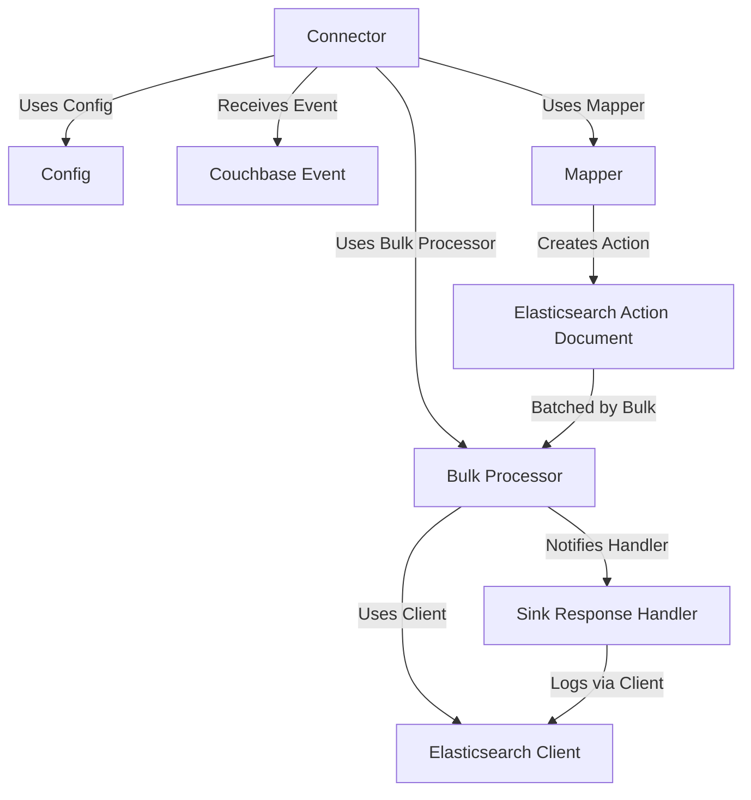

# Tutorial: go-dcp-elasticsearch

The `go-dcp-elasticsearch` project acts as a **bridge** between Couchbase and Elasticsearch.
It **listens** for *data changes* in a Couchbase bucket using the Database Change Protocol (DCP).
These changes are then *transformed* and **sent** to Elasticsearch in an efficient, **batched** manner,
optionally handling *processing results* (successes/failures) and logging rejections.

## Visual Overview

## Chapters

1. [Couchbase Event
   ](01_couchbase_event_.md)
2. [Elasticsearch Action Document
   ](02_elasticsearch_action_document_.md)
3. [Connector
   ](03_connector_.md)
4. [Config
   ](04_config_.md)
5. [Mapper
   ](05_mapper_.md)
6. [Bulk Processor
   ](06_bulk_processor_.md)
7. [Elasticsearch Client
   ](07_elasticsearch_client_.md)
8. [Sink Response Handler
   ](08_sink_response_handler_.md)
